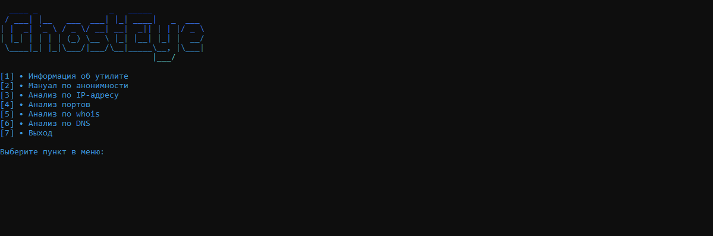

## 🚀 Установка и запуск

> [!TIP]
> Для стабильной работы утилиты рекомендуется использовать Python версии 3.8 или выше.

### 1. Клонирование репозитория
Откройте терминал (или командную строку) и выполните команду:
```bash
git clone https://github.com/Eurostackio/GhostEye.git
cd GhostEye
```

> [!IMPORTANT]
># 2. Установка зависимостей
>Установите все необходимые библиотеки одной командой:
>pip install -r requirements.txt

> [!TIP]
># 3. Быстрый старт
>Для запуска утилиты выполните главный скрипт:
>python GhostEye.py

После запуска перед вами откроется интерактивное консольное меню. Просто выберите нужный пункт (например, [3] для анализа IP-адреса или [4] для сканирования портов) и следуйте инструкциям на экране.
